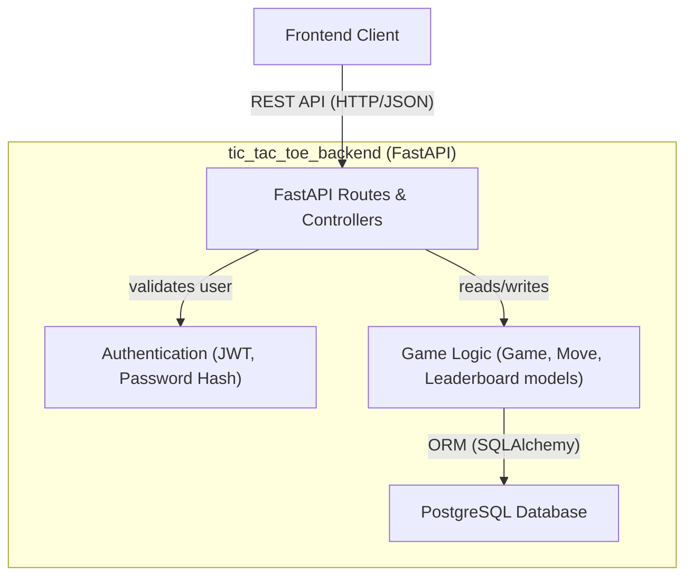

# Tic Tac Toe Backend (FastAPI)

## Project Purpose

This backend implements the business logic, REST API, database persistence, authentication, and multiplayer/game management for Tic Tac Toe Pro. It provides endpoints for registration, login (JWT-based), game play (single and multiplayer), high score tracking, and user history, supporting a modern frontend client.

## Prerequisites

- Python 3.9+
- PostgreSQL database
- Recommended: virtualenv for python dependencies

## Setup Instructions

1. **Clone the repository** and navigate into the backend directory:
   ```bash
   cd tic_tac_toe_backend
   ```

2. **Install dependencies**:
   ```bash
   pip install -r requirements.txt
   ```

3. **Configure environment variables** (optional but recommended for security/production):
   - `JWT_SECRET_KEY` (default: `supersecretkey`)
   - `POSTGRES_USER` (default: `tic_tac_toe_user`)
   - `POSTGRES_PASSWORD` (default: `password`)
   - `POSTGRES_DB` (default: `tic_tac_toe_db`)
   - `POSTGRES_HOST` (default: `localhost`)
   - `POSTGRES_PORT` (default: `5432`)

   Place these variables in a `.env` file in the project root or set them directly in your environment.

4. **Run database server** (PostgreSQL). Ensure the matching user/database exists (the app creates tables automatically if DB exists).

5. **Start the backend API server**:
   ```bash
   uvicorn src.api.main:app --reload --host 0.0.0.0 --port 8000
   ```

## Running and Development

- The server will be available at [http://localhost:8000](http://localhost:8000)
- Swagger/OpenAPI docs: [http://localhost:8000/docs](http://localhost:8000/docs)
- CORS is enabled for all origins in development.

## Environment Variables

| Variable          | Description                           | Default               |
|-------------------|---------------------------------------|-----------------------|
| JWT_SECRET_KEY    | JWT signing key (for auth)            | supersecretkey        |
| POSTGRES_USER     | DB user for PostgreSQL                | tic_tac_toe_user      |
| POSTGRES_PASSWORD | DB password                           | password              |
| POSTGRES_DB       | Database name                         | tic_tac_toe_db        |
| POSTGRES_HOST     | Database host                         | localhost             |
| POSTGRES_PORT     | Database port                         | 5432                  |

## API Summary

The backend exposes multiple endpoints under `/api`. Below are the most important routes:

### Authentication

- `POST /api/auth/register`
  - Register new user (`{ "username": str, "password": str }`)
  - Returns: `{ "id": int, "username": str }`

- `POST /api/auth/login`
  - Login form (`application/x-www-form-urlencoded`): `username`, `password`
  - Returns: `{ "access_token": str, "token_type": "bearer" }`

### Game

- `POST /api/game/new`
  - Start new game. Body: `{ "type": "single" | "multi" }`
  - Returns: Game object (see below).
  - Multi mode: enters matchmaking if no pending game.

- `POST /api/game/{game_id}/move`
  - Make a move in a game.
  - Body: `{ "x": int, "y": int }`
  - Returns: Updated Game object.

### Leaderboard

- `GET /api/leaderboard`
  - Returns win/loss/tie stats for registered users.
  - Example response:
    ```json
    [
      { "username": "user1", "wins": 2, "losses": 1, "ties": 1 },
      ...
    ]
    ```

### History

- `GET /api/history`
  - Shows games played by the authenticated user.
  - Returns list of detailed game history.

### Example JWT-protected request

All non-auth endpoints require a Bearer JWT token in the header:

```
Authorization: Bearer <token>
```

## API Example Payloads

**Register**
```json
POST /api/auth/register
{
  "username": "alice",
  "password": "secretpw"
}
```

**Login**
```
POST /api/auth/login
username=alice&password=secretpw
```

**Create a game**
```json
POST /api/game/new
{
  "type": "single"
}
```

**Make a move**
```json
POST /api/game/1/move
{
  "x": 0,
  "y": 2
}
```

## Architecture Diagram



## Example User/Game Flow

1. **Registration**: User registers via `/api/auth/register`.
2. **Login**: User logs in via `/api/auth/login` and receives JWT.
3. **Lobby**: User (frontend) can create a new game (`/api/game/new`) or join an open multiplayer match.
4. **Gameplay**: Players take turns sending moves to `/api/game/{id}/move`.
5. **Game end**: Result is persisted; leaderboard is updated.
6. **History/Leaderboard**: User may query `/api/history` and `/api/leaderboard` for stats and past games.

---
